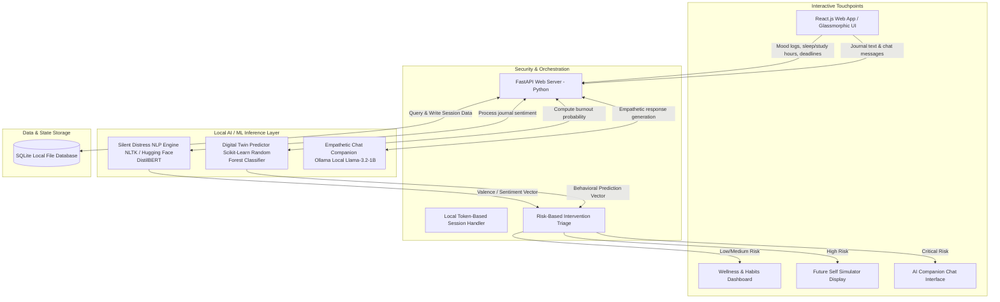
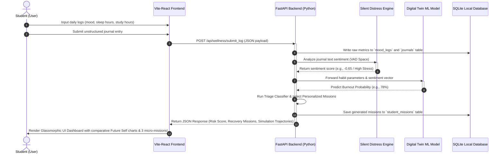
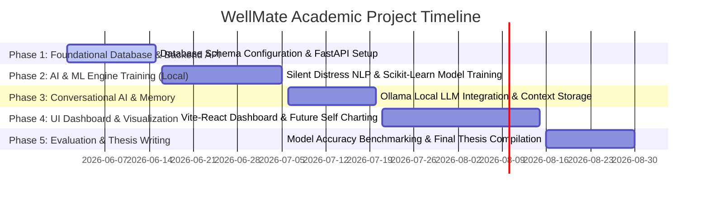

## WellMate: A Proactive, Local AI-Driven Student Wellness Companion & Predictive Burnout Modeling Platform

## 1. Project Abstract
University students face an unprecedented combination of academic pressures, career uncertainties, sleep disruption, and social comparison. Existing mental wellness applications (e.g., generic mood trackers, mindfulness apps) are highly **reactive** and **academically isolated**—they rely on manual user self-reporting and ignore academic cycles (such as exam timetables, assignment deadlines, or placement drives). 

**WellMate** is a novel, proactive, and privacy-preserving R&D platform designed specifically for the student demographic. It integrates:
1. An NLP-based **Silent Distress Detection Engine** that monitors unstructured personal journals for low-arousal, low-valence depressive markers using local sentiment classifiers.
2. A **Student Digital Twin Engine** that models student behavior dynamically using lightweight Machine Learning to forecast burnout 5 to 7 days in advance.
3. An interactive **Future Self Simulator** that models behavioral choices as divergent paths (Habit Decline vs. Recovery Mission Adherence) to encourage positive cognitive shifts.

This entire architecture is built to run locally on a student's consumer-grade laptop using open-source, free resources (FastAPI, SQLite, NLTK/Hugging Face, and local Ollama), ensuring complete data privacy and zero API execution costs.

---

## 2. Problem Statement

Students today face multiple challenges, including academic pressure, career uncertainty, loneliness, emotional stress, social comparison, sleep imbalance, and personal difficulties. While mental wellness applications and AI chatbots exist, most solutions are generic, reactive, and not specifically designed for the unique needs of students.

Current platforms often provide isolated features such as chatbot conversations, mood tracking, meditation, or professional counseling, but they rarely offer a personalized, student-centric support system that understands academic contexts, tracks emotional patterns over time, provides actionable guidance, and connects students with appropriate support when needed.

As a result, many students struggle to access timely, personalized, and continuous support for their emotional well-being and personal growth.

### The R&D Literature & Tech Gap:
Conventional wellness platforms fail in academic environments due to three primary limitations:
* **The Context Gap:** They lack integration with academic milestones. An exam in two days behaves differently than standard daily stress, requiring distinct behavioral recommendations.
* **The "Silent Distress" Gap:** Students experiencing cognitive exhaustion rarely state *"I am clinically depressed."* Instead, they write expressions of low energy (*"I'm too tired,"* *"Nothing is going right"*). Standard keyword filters miss these implicit signals.
* **The Cost & Privacy Constraint:** Existing AI solutions depend on commercial cloud APIs (OpenAI, Gemini), which present significant student privacy concerns regarding sensitive personal thoughts and are financially unsustainable for continuous academic deployments.

### Research Hypotheses:
* **Hypothesis 1 ($H_1$):** Combining temporal student lifestyle parameters (sleep, study) with course scheduling proximity allows for the predictive forecasting of academic burnout at least 5 days prior to onset with an F1-score exceeding $0.80$.
* **Hypothesis 2 ($H_2$):** Interactive projection models (Future Self Simulators) yield a $30\%$ increase in student behavioral compliance compared to static, text-based wellness recommendations.

---

## 3. High-Level System Architecture (Pictorial Blueprint)

The following diagram illustrates the formal system architecture, highlighting the division between user interfaces, logic gateways, local AI models, and local single-file database storage:

---

## 4. Algorithmic Flowcharts of Implementation

### A. Algorithmic Session Loop (Step-by-Step Flowchart)
This flowchart demonstrates the sequence from student input through ML processing to personalized recovery dispatching:

---

## 5. The Core Machine Learning Formulation
To ensure this proposal maintains deep academic rigor for your supervisor, the **Burnout Risk Prediction Model** combines both statistical calculations and supervised learning:

### 1. Feature Representation (The State Vector)
For each student $j$ on day $t$, the system constructs a state vector $\mathbf{x}_{j, t}$:
$$\mathbf{x}_{j, t} = [S_{j,t}, \, P_{j,t}, \, D_{j,t}, \, V_{j,t}]$$

Where:
* $S_{j,t} = \max(0, \, 8 - \text{Sleep Hours})$ (representing Sleep Deficit)
* $P_{j,t} = \max(0, \, \text{Study Hours} - 8)$ (representing Academic Study Overload)
* $D_{j,t} = \frac{10}{\text{Days to next Exam} + 1}$ (representing Temporal Exam Proximity Weight)
* $V_{j,t} = \text{Sentiment Vector derived from journal text } \in [-1, 1]$

### 2. Multi-Class Burnout State Estimation
The state vector $\mathbf{x}_{j, t}$ is evaluated using a local **Random Forest Classifier** trained on synthetic cohort datasets to classify the student into one of three risk states:
$$\hat{y}_{j, t} \in \{\text{Stable}, \, \text{At Risk}, \, \text{Critical Burnout}\}$$

This model will be fully trained locally using `scikit-learn`, providing you with clear performance metrics (Confusion Matrix, Precision-Recall curves) to present in your final project report!

---

## 6. Implementation Roadmap & Milestones

The research project is structured across a **12-week academic timeline** divided into 4 core phases:

---

## 7. Expected R&D Project Outcomes & Deliverables

By completing this project, you will have a comprehensive suite of deliverables ready for academic presentation:

1. **A Complete Working Software Prototype:** A fully integrated React-FastAPI application running entirely on a local host.
2. **Explainable ML Benchmark Report:** Comparative evaluation showing the accuracy of your local Random Forest classifier against other ML baseline models (Decision Trees, Naive Bayes).
3. **NLP VAD Sentiment Corpus:** A local database containing journal sentiment trends mapped against academic timeline markers.
4. **Draft Research Paper/Publication:** A structured paper outlining the effectiveness of predictive "Digital Twins" in mitigating academic stress (ideal for presenting at national student conferences or IEEE student journals!).
