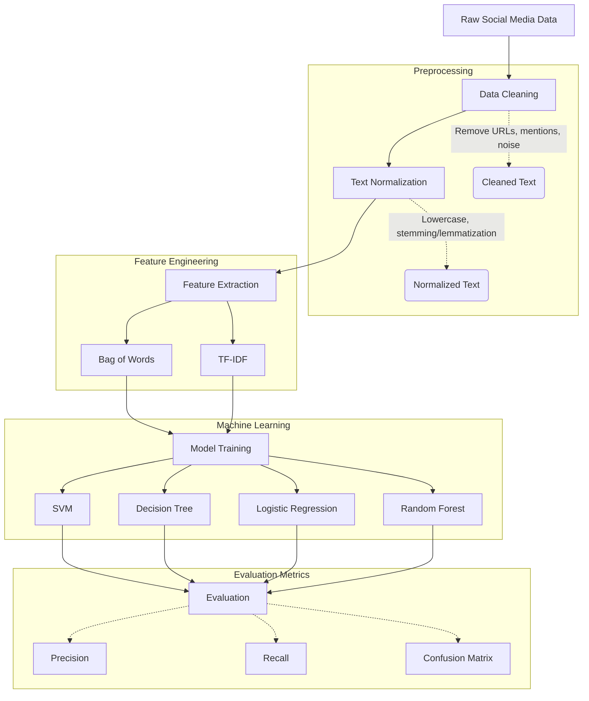

# Social Media Mental Health Risk Analyzer

## 📖 What this project is about

This project is an attempt to understand whether patterns in social media text can indicate signs of mental stress or risk.

Instead of overcomplicating things, the focus here is simple: take raw text → convert it into meaningful features → train ML models → and see what actually works and what doesn’t.

##    Goal

The overarching goal isn't merely to build another machine learning model, but to explore and understand how far algorithms can go in detecting mental health-related patterns in text data.

## ❗ The Problem in Simple Terms

People rarely say explicitly, “I am depressed,” on social media. They express it indirectly—through their tone, word choice, and behavioral patterns.

The challenge is:
- **Text is inherently messy:** Social media language is unstructured.
- **Meaning is not always obvious:** Tone and context matter.
- **Data is massive and noisy:** Filtering out irrelevant information is hard.

So, the idea is to treat this as a text classification problem and see if Machine Learning can successfully pick up these subtle patterns.

## 🏗️ Architecture & Pipeline

Here is a high-level overview of the data pipeline:



## ⚙️ How I am Approaching It

This project follows a very practical, step-by-step pipeline:

1. **Start with the data:** Use an available dataset (like from Twitter or Reddit) and ensure it has some form of labels, even if they are imperfect.
2. **Clean the data (the real work):** Remove URLs, symbols, and noise. Normalize the text (e.g., lowercase conversion) while keeping it simple—no over-processing.
3. **Convert text into numbers:** Since ML models don’t understand text directly, we use solid basics like **Bag of Words** and **TF-IDF**. Nothing overly fancy at the start.
4. **Train ML models:** Using models I’ve already worked with to compare and understand their behavior:
   - SVM (Main focus)
   - Decision Tree
   - Logistic Regression
   - Random Forest
5. **Evaluate properly:** Accuracy isn't enough. The focus is specifically on:
   - **Precision**
   - **Recall** (Crucial: missing a risky case is far worse than a false alarm)
   - **Confusion Matrix**

## 💻 Tech Stack

- **Language:** Python
- **Data Processing:** Pandas, NumPy
- **Natural Language Processing (NLP):** NLTK, spaCy, or Scikit-learn feature extraction
- **Machine Learning:** Scikit-learn
- **Data Visualization:** Matplotlib, Seaborn

## 🧠 What I Actually Want to Learn

This project is more about the "why" and "how" than just the final product. Some questions I aim to answer:

- Do simple ML models work effectively on this kind of data?
- Which textual features actually matter the most?
- Does TF-IDF capture enough meaningful signal?
- Which model handles noisy text better?
- Where do the models consistently fail?

## 🔍 Observations (What I Will Focus On)

While working, I’ll track:
- Common words/features in risky vs. normal text.
- Performance differences across models.
- Edge cases where models are clearly wrong.
- Whether the predictions actually make sense logically.

A model with good accuracy but absolutely no logical sense is useless in this context.

## 📈 Expected Outcome

By the end, this project will realistically provide:
- A working, end-to-end ML pipeline for text classification.
- A comprehensive comparison between foundational ML models.
- A clear understanding of the limitations of basic ML on complex human psychological problems.

Not aiming for perfection—aiming for clarity and understanding.

## 🧱 Project Structure

```text
project/
│── data/         # raw + processed datasets
│── notebooks/    # experiments and Jupyter notebooks
│── src/          # source code
│   ├── preprocessing.py
│   ├── features.py
│   ├── train.py
│   └── evaluate.py
│── results/      # outputs, figures, and metrics
│── README.md
```

## 🚀 Final Thought

This project is less about “building something impressive” and more about actually understanding how machine learning behaves when faced with real, messy, and nuanced human data.
